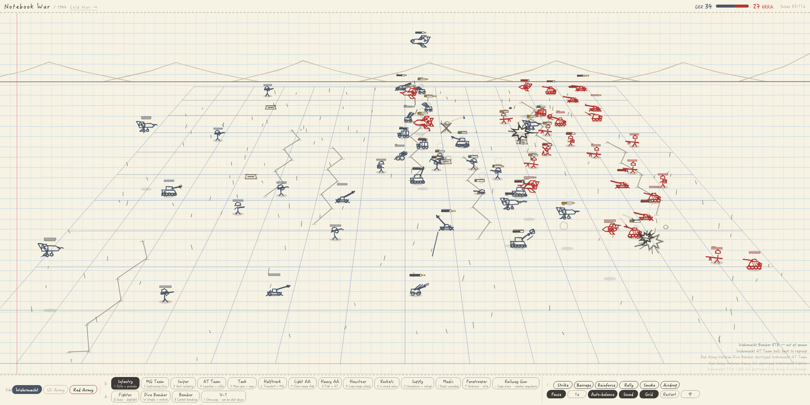
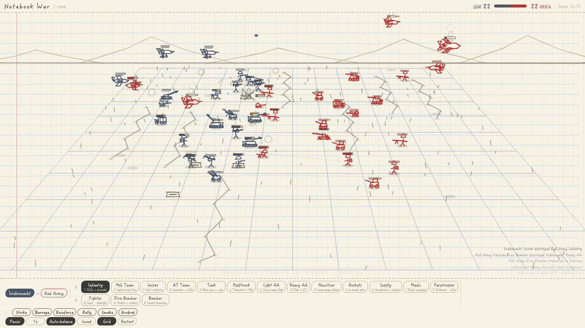
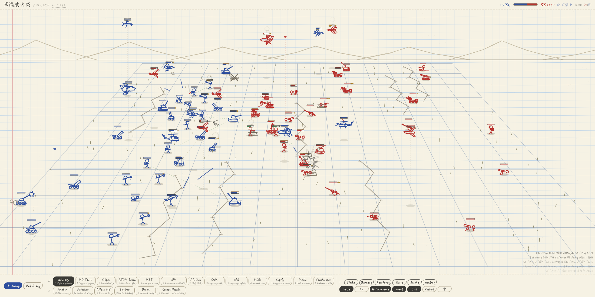
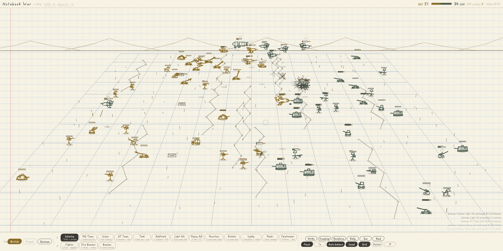
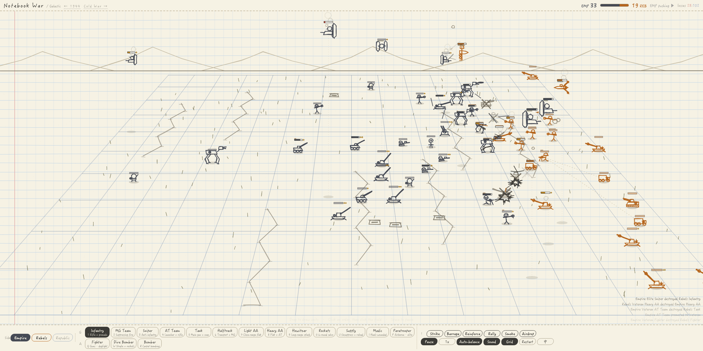

# Notebook War

*The war I used to draw in the margins of my school notebooks — rebuilt so that it fights itself.*

**English** · [中文](README.zh-CN.md)

**[▶ Play it in your browser](https://fong353.github.io/notebook-war/)**
 · [1918](https://fong353.github.io/notebook-war/ww1.html)
 · [Cold War](https://fong353.github.io/notebook-war/cold-war.html)
 · [Galactic](https://fong353.github.io/notebook-war/starwars.html)

## Why I built this

When I was a kid I drew wars in the margins of my exercise books. Tanks and planes on both sides,
pencil lines for tracer fire, a scribble over whatever got hit. There were never any rules — I just
wanted to watch the two sides go at each other, and I'd add another tank whenever one side started
losing.

This is that drawing, rebuilt as something that runs on its own. You don't command anyone. You draw
units onto the paper and they fight by themselves; if you never touch it again, the battle still
plays out. Everything I liked about the original is still here — it looks like ballpoint on graph
paper, every unit has a health bar, and ground and air shoot at each other.

Everything I *didn't* know how to draw back then is what the code is for: infantry that get pinned
down by machine-gun fire and crawl into a trench, tanks that throw a track and start smoking, dive
bombers that have to fly a real attack run instead of hovering over the target.

## What it is

A single HTML file. No build step, no dependencies, no network calls — open it and it runs.

- **Four settings.** `ww1.html` is 1918 — British, French and German, and the one where the trench
  system finally matters: barbed wire that snags infantry while tanks flatten it, drifting gas that
  keeps hurting whoever is caught in it, a creeping barrage that walks forward a rank at a time,
  rhomboid Mark IVs, a Fokker triplane and a Zeppelin overhead. It is also where the two
  set-pieces about obsolete tactics live: a battalion going *over the top* at a walk because
  the barrage was supposed to have cut the wire, and a cavalry squadron that only turns up
  when the enemy line has actually thinned — the gap the cavalry divisions spent four years
  waiting for and almost never got.
  `index.html` is 1944: Wehrmacht, US Army and Red Army, pick any two to fight.
  `cold-war.html` is US vs USSR, with helicopters, drones and cruise missiles.
  `starwars.html` is Empire / Rebels / Republic — walkers instead of tanks, so an AT-AT strides in
  on four jointed legs while a TIE fighter holds its hex panels overhead.
- **Bilingual.** One button in the corner switches the whole interface between English and Chinese,
  designations included (`Pz.VI Tiger` ↔ `Pz.VI 虎式`).
- **Sixteen-odd unit types**, each with real equipment per nation — a Tiger, a Sherman and a T-34 are three
  different silhouettes, not three colours of the same box.
- **Weapons are separate things.** A unit carries one or two, each with its own range, reload and
  ammo, and picks between them by expected damage against the current target. A tank uses its coax
  machine gun on infantry and saves the main gun for armour. A fighter fires its wing guns in a
  turning fight because a missile has a minimum range.
- **Suppression drives the infantry fight.** Fire landing nearby pins men down whether or not it
  hits; pinned infantry crawl for the nearest trench or bunker and stop advancing.
- **Set-pieces arrive on their own.** Every minute or so something outsized turns up without you
  asking: a V-2 that simply lands with no warning and nothing that can intercept it, a V-1 slow
  enough for the flak to get a shot at, a B-17 formation, a Katyusha battalion. 1918 gets its own —
  Zeppelin raids, the Paris Gun, a railway gun that rolls on and shells the line, over-the-top
  waves, a cavalry charge. The Cold War has Warthog runs and Bear flyovers; the galactic setting
  has AT-ATs striding in and the Hoth ion cannon. Each belongs to one nation, so you only see it
  when that nation is in the match — and when something rolls out to fire, you see the guns
  themselves arrive, shoot and withdraw, rather than shells falling out of an empty sky.
- **Commander orders** on cooldowns — air strike, barrage, reinforce, rally, smoke, airdrop, plus a
  mine in 1918 — so you can lean on the battle without micromanaging it. One of them, with no cooldown, stages a
  **set-play** — a one-off action like a charge, a barrage or a V-2. The button is labelled with
  whichever one is standing by, so you always know what you are about to set off; each has its own
  precondition, so what is on offer changes as the battle does. The outsized *formations* stay
  unrequestable: a Zeppelin, Jasta 11 or the Cambrai wedge still turns up on its own or not at all.

## Running it

[Play online](https://fong353.github.io/notebook-war/), or open `index.html` from a local copy —
it needs no server, no build step and makes no network calls.

- `?warmup=45` skips ahead 45 in-game seconds, so you land in the middle of a fight instead of at
  the opening deployment. `?units=38` raises each side's target strength from the default 17 —
  good for a wide screen and a proper mass engagement. `?lang=en|zh` forces a language.
- Drag on the field to draw units. Click an order, then click the field to aim it.
- Hover any unit to see its designation, weapons, remaining ammo and current state.
- `Space` pauses, number/letter keys pick a unit type, `Tab` switches which side your pen belongs to.
- **Scroll to zoom, drag with the middle button to pan** — useful for watching a single skirmish up
  close. It is a pure screen-space transform, so nothing about the battle changes while you look.
- Works on phones — there's a **Rotate** button, because a battlefield wants to be wide.

## Notes on how it works

A few decisions that turned out to matter more than expected:

**Cheated perspective.** The ground is a real one-point-perspective grid, but unit scale is
deliberately *not*. True perspective shrinks the far rank to 47% and you can't read it any more;
no scaling at all and the depth disappears. It settles at about 62%.

**Fixed-wing aircraft can't use converging movement.** Steering a plane by `(target - self) / dist`
looks fine until you notice `dist` is three-dimensional: a plane at altitude 95 over a tank on the
ground still has 95 units of separation when it's directly overhead, so the numerator goes to zero
while the denominator doesn't, and the plane decelerates to a hover above its target. Attack runs
are driven by a leg counter instead — fly this far, break off, turn, come back — which never
deadlocks no matter how the target moves.

**Making the battle watchable was not about slowing the rate of fire.** Sparse fire just makes a
dull picture. What was needed was units that survive the first exchange, so both sides stay tangled
together: more health, assault units pushing to knife range, and minimum ranges on missiles so
close-in fighting falls back to guns.

**Unit scale is calibrated at startup, not hand-tuned.** Each unit is drawn by hand, stroke by
stroke, so their sizes had drifted apart — before this was fixed, the tank was *shorter than the
infantryman* in all four eras. Sizes now come from one rule: take the unit's real height, divide by
1.8 m, raise it to the 0.55 power. Literal scale would turn infantry into ants; no scaling at all
and nothing has any weight. On boot the game traces every unit once through a context that only
records coordinates, measures how tall it actually draws, and solves for the correction — so
redrawing a unit never means recomputing a constant by hand.

**Armour needed a second tier before the numbers could be honest.** Every weapon had one
anti-armour multiplier, and aircraft were flagged as armoured too — so the same number decided
both *can this gun win a dogfight* and *can it pierce a tank*. Fighter guns had to be set high
enough to matter in the air, which quietly let them drill through a Tiger. Splitting armour into
two tiers — aircraft and light vehicles on one, tanks on the other — let machine guns become
useless against tanks without breaking air combat, which is what made a tank feel like a tank.

**Craters fade by erasing the whole scar layer a little at a time**, rather than storing a lifetime
per crater and redrawing all of them each frame. Old craters have been erased more often, so they
disappear first.

## Acknowledgements

Built in conversation with **Claude Opus 5**. I described the drawing I used to make as a kid and it
wrote the first version in a single file; after that we went a round at a time — I'd point at
whatever felt wrong ("the jets should fly back and forth", "dogfights end too fast", "the health
bars overlap the tanks") and it would implement the change, then show me the measurements on
whether it actually worked.

What I didn't expect was how often the real cause sat somewhere other than where I was pointing.
Suppression felt weak not because the numbers were low, but because attrition had thinned the field
to 14 units and fire was never dense enough to pin anyone. Dogfights ended fast not because guns
hit too hard, but because missiles had no minimum range, so 58 damage kept landing at knife
distance. The aircraft weren't refusing to fly attack runs out of stubbornness — steering by a
three-dimensional distance makes a plane decelerate to a hover directly above its target. It found
all three by instrumenting the simulation and reading the output rather than guessing, and said so
plainly when a change I'd asked for had broken a different mechanic. The commit history is the
honest log of all of it.

## License

MIT — see [LICENSE](LICENSE).
